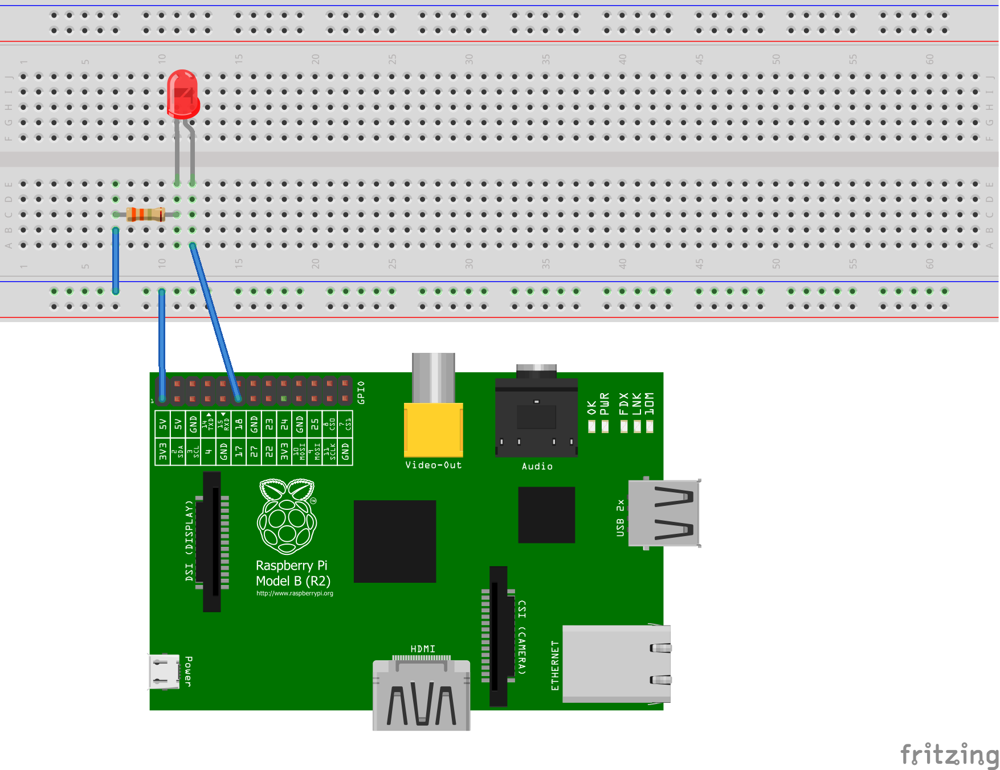

pi-morse
========

pi-morse.py is a command-line python script that turns ASCII text into 
[ITU-Standard morse code][1], then flashes the appropriate pattern on an LED 
connected to a Raspberry Pi model B's GPIO pin 17.

In other words, it turns your Raspbery Pi into a morse code signalling device!

## Physical Layout

## Usage

Since pi-morse uses the GPIO pins, it has to run with elevated permissions.
This means putting `sudo` in front of your commands on most Linux-like systems.

The general form for pi-morse commands is:

    sudo python pi-morse.py "message"

To flash **S O S** on the LED, try:

    sudo python pi-morse.py "sos"

## MIT License

Copyright (c) 2014 Philip Conrad

Permission is hereby granted, free of charge, to any person obtaining a copy
of this software and associated documentation files (the "Software"), to deal
in the Software without restriction, including without limitation the rights
to use, copy, modify, merge, publish, distribute, sublicense, and/or sell
copies of the Software, and to permit persons to whom the Software is
furnished to do so, subject to the following conditions:

The above copyright notice and this permission notice shall be included in all
copies or substantial portions of the Software.

THE SOFTWARE IS PROVIDED "AS IS", WITHOUT WARRANTY OF ANY KIND, EXPRESS OR
IMPLIED, INCLUDING BUT NOT LIMITED TO THE WARRANTIES OF MERCHANTABILITY,
FITNESS FOR A PARTICULAR PURPOSE AND NONINFRINGEMENT. IN NO EVENT SHALL THE
AUTHORS OR COPYRIGHT HOLDERS BE LIABLE FOR ANY CLAIM, DAMAGES OR OTHER
LIABILITY, WHETHER IN AN ACTION OF CONTRACT, TORT OR OTHERWISE, ARISING FROM,
OUT OF OR IN CONNECTION WITH THE SOFTWARE OR THE USE OR OTHER DEALINGS IN THE
SOFTWARE.

   [1]: http://en.wikipedia.org/wiki/Morse_code
